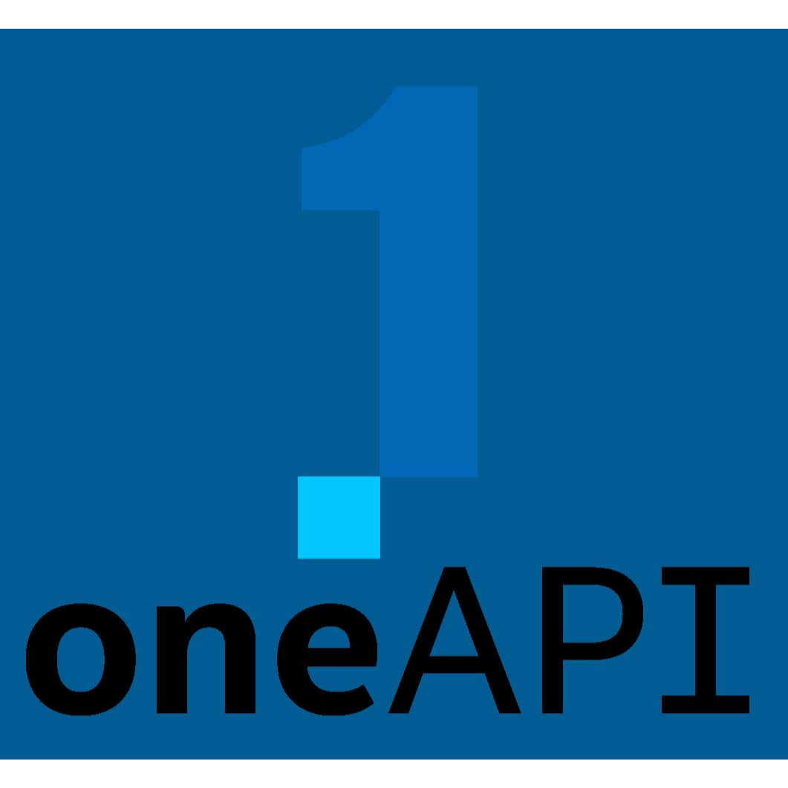

<center>  </center>

<h1> Hi, I’m Lapys!  </h1>
Standard <b>library developer</b> for <b><a href="https://github.com/LapysDev/Lapys-C-">C++</a></b> and <b><a href="https://github.com/LapysDev/LapysJS">JavaScript</a></b> respectively &#128218; <br/> <br/>

```cpp
constinit ::Developer<🌙> stats {
  .name        = "Funto Oshodi",
  .skills      = ["art illustration", "gamedev.", "graphics design", "webdev.", …],
  .credentials = [
    "Games Design"     \ "South Essex College",
    "Computer Science" \ "Covenant University"
  ]
};
```
<hr/>

<h3> Fun facts </h3>
<ul>  
  <li> <b><a href="https://en.wikipedia.org/wiki/Lapis_lazuli" target="_blank" rel="noopener noreferrer">Lapis lazuli</a>:</b> <i>Deep-blue</i> metamorphic precious stone </li>
  <li> <b><a href="https://en.wikipedia.org/wiki/Lapis_manalis" target="_blank" rel="noopener noreferrer">Lapis manalis</a>:</b> Roman sacred stone either used to make it rain or used to cover a gate to Hades (the realm of the dead) </li>
  <li> <b><a href="https://en.wikipedia.org/wiki/Lapis_Niger" target="_blank" rel="noopener noreferrer">Lapis Niger</a>:</b> Ancient shrine in the Roman Forum </li>
  <li> <b><a href="https://en.wikipedia.org/wiki/Philosopher's_stone" target="_blank" rel="noopener noreferrer">Lapis philosophorum</a>:</b> Alchemical prima materia capable of <i>transmuting lesser materials</i> such as lead to <i>higher substances</i> like gold/ silver </li>
</ul>

<h2> &#128205; Find me at </h2>
Connect with on these alternative platforms &mdash; feel free to see what interests you <br/> <br/>
<table>
  <tbody align="center">
    <tr>
      <td> <a href="https://www.artstation.com/lapys" title="ArtStation">  </a> </td>
      <td> <a href="https://lichess.org/@/LapysArts" title="LiChess">  </a> </td>
      <td> <a href="https://www.stackoverflow.com/users/7364573/lapys" title="StackOverflow">  </a> </td>
      <td> <a href="https://www.twitter.com/Lapys_Arts" title="Twitter">  </a> </td>
      <td> <a href="https://www.youtube.com/channel/UCaDSL0cTCxuA3EBd94IBHVw" title="YouTube">  </a> </td>
    </tr>
  </tbody>
</table>

<h2> &#128736; Shed Tools </h2>
Curious with the setup I use? <br/> <br/>
<table>
  <tbody align="center">
    <tr>
      <th rowspan="2"> Languages </th>
      <td> <a href="https://en.wikipedia.org/wiki/C_(programming_language)" title="C">  </a> </td>
      <td> <a href="https://en.wikipedia.org/wiki/C++" title="C++">  </a> </td>
      <td> <a href="https://en.wikipedia.org/wiki/CSS" title="CSS (Cascading Style Sheets)">  </a> </td>
      <td> <a href="https://en.wikipedia.org/wiki/HTML" title="HTML (HyperText Markup Language)">  </a> </td>
      <td> <a href="https://en.wikipedia.org/wiki/JavaScript" title="JavaScript (vanilla)">  </a> </td>
    </tr>
    <tr>
      <th title="General-purpose programming language. By design, its features cleanly reflect the capabilities of the targeted CPUs, finding lasting use in operating systems, device drivers, protocol stacks, and application software"> C </th>
      <th title="General-purpose programming language. First released as an extension of the C, it has since significantly expanded beyond it over time. Designed with (large) systems programming and resource-constrained software in mind, with performance, efficiency, and flexibility as its focus"> C++ </th>
      <th title="Style sheet language used for describing the presentation of a document written in a markup language such as HTML (or XML)"> CSS </th>
      <th title="The HyperText Markup Language is the standard markup language for documents designed to be displayed in a web browser"> HTML </th>
      <th title="Compiled (and often Just-In-Time) programming language that is multi-paradigm, supporting event-driven, functional, and imperative coding styles"> JS&#127846; </th>
    </tr>
  </tbody>
</table>
<table>
  <tbody align="center">
    <tr>
      <th rowspan="2"> Tools &amp; IDEs </th>
      <td> <a href="https://www.git-scm.com" title="Git">  </a> </td>
      <td> <a href="https://www.msys2.org" title="MSYS2 (Minimal System 2)">  </a> </td>
      <td> <a href="https://www.intel.com/content/www/us/en/developer/tools/oneapi/dpc-compiler.html" title="Intel oneAPI">  </a> </td>
      <td> <a href="https://www.runjs.app" title="Run JS">  </a> </td>
      <td> <a href="https://www.sublimetext.com" title="Sublime Text">  </a> </td>
    </tr>
    <tr>
      <th title="Distributed version control system that tracks changes in any set of computer files, usually used for coordinating work among programmers collaboratively developing source code during software development. Its goals include speed, data integrity, and support for distributed, non-linear workflows"> Git </th>
      <th title="Collection of tools and libraries providing you with an easy-to-use environment for building, installing and running native Windows software"> MSYS2 </th>
      <th title="Open, cross-architecture programming model that frees developers to use a single code base across multiple architectures"> oneAPI </th>
      <th title="JavaScript playground for desktop operating systems. It runs code as it’s written and displays formatted results in its output panel"> Run JS </th>
      <th title="Shareware text and source code editor which natively supports many markup and programming languages"> Sublime </th>
    </tr>
  </tbody>
</table>

<hr/>


