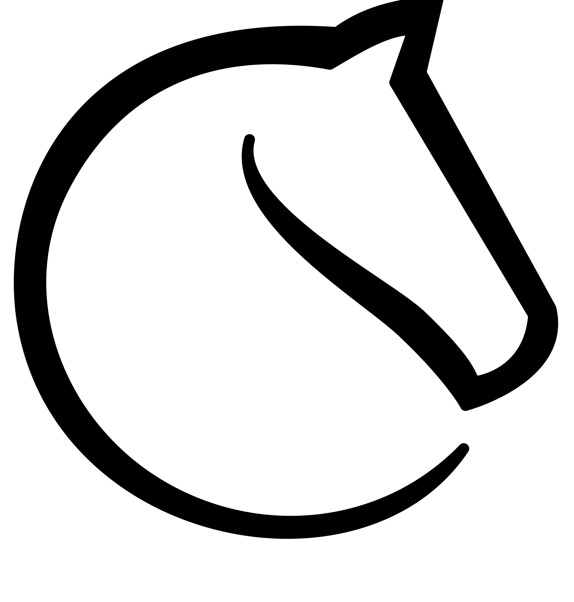

<center>  </center>

<h1> Hi, I’m Lapys 👋🏾 </h1>


[](https://twitter.com/intent/follow?original_referer=https%3A%2F%2Fgithub.com%2FLapysDev&screen_name=Lapys_Arts)

```cpp
constinit ::Creator<🤵🏾> stats {
  .name      = "Funto Oshodi",
  .age       = 22zu,

  .location  = ["Basildon, United Kingdom 🇬🇧", "Lagos, Nigeria 🇳🇬"],
  .skills    = ["art illustration", "graphics design", "webdev", …],
  .interests = ["animation", "gamedev", "music", …]
};
```
Currently working on standard libraries for C++ and JavaScript 📚 <br/>
<hr/>

<h4> Fun facts </h4>
<ul>  
  <li> <a href="https://en.wikipedia.org/wiki/Lapis_lazuli"        target="_blank" rel="noopener noreferrer">Lapis lazuli</a> is a deep-blue metamorphic precious stone </li>
  <li> <a href="https://en.wikipedia.org/wiki/Lapis_manalis"       target="_blank" rel="noopener noreferrer">Lapis manalis</a> is a Roman sacred stone either used to make it rain or used to cover a gate to Hades (the realm of the dead) </li>
  <li> <a href="https://en.wikipedia.org/wiki/Lapis_Niger"         target="_blank" rel="noopener noreferrer">Lapis Niger</a> (meaning “Black Stone”) is an ancient shrine in the Roman Forum </li>
  <li> <a href="https://en.wikipedia.org/wiki/Philosopher's_stone" target="_blank" rel="noopener noreferrer">Lapis philosophorum</a> is the alchemical prima materia capable of transmuting lesser materials such as lead to higher substances like gold/ silver </li>
</ul>
<br/>

<h2> Find me at </h2>
Connect with on these platforms outside GitHub <br/>
Feel free to see what interests you <br/>

<br/>
<a href="https://www.artstation.com/lapys"                         title="ArtStation">     </a>
<a href="https://lichess.org/@/LapysArts"                          title="LiChess">        </a>
<a href="https://www.stackoverflow.com/users/7364573/lapys"        title="StackOverflow">  </a>
<a href="https://www.twitter.com/Lapys_Arts"                       title="Twitter">        </a>
<a href="https://www.youtube.com/channel/UCaDSL0cTCxuA3EBd94IBHVw" title="YouTube">        </a>
<br/>

<hr/>

<h2> Tools in the shed </h2>
If you’re curious with my setup and what I use to program <br/>

<br/>

<a href="https://www.git-scm.com"     title="Git">           </a>
<a href="https://www.msys2.org"       title="msys2">         </a>
<a href="https://www.runjs.app"       title="Run JS">        </a>
<a href="https://www.sublimetext.com" title="Sublime Text">  </a>
<br/>

<a href="https://en.wikipedia.org/wiki/C_(programming_language)" title="C">           </a>
<a href="https://en.wikipedia.org/wiki/C++"                      title="C++">         </a>
<a href="https://en.wikipedia.org/wiki/CSS"                      title="CSS">         </a>
<a href="https://en.wikipedia.org/wiki/HTML"                     title="HTML">        </a>
<a href="https://en.wikipedia.org/wiki/JavaScript"               title="JavaScript">  </a>
<br/>

<hr/>

<details>
  <summary> 🌙 GitHub Stats. </summary>

  <br/>
  
  <br clear="all"/>
</details>

<details>
  <summary> 🌙 Languages I Use </summary>

  <br/>
  
  <br clear="all"/>
</details>
